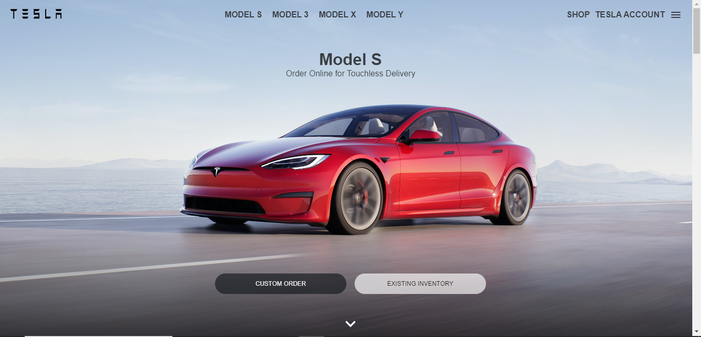

# Original Website


# Tesla Clone App



This is a static clone of the Tesla website, created for educational purposes. The app provides a visual representation of the Tesla website's main page and features various components.

## Components

### 1. Header
- The header section includes the Tesla logo and navigation links.
- It provides easy access to different Tesla vehicle models.

### 2. Hero Section
- The hero section features an image or video showcasing a Tesla vehicle.
- It may include a call-to-action button or caption.

### 3. Model Sections
- Multiple sections display different Tesla models.
- Each section includes an image, model name, and a brief description.
- Users can click on each model to learn more.

### 4. Features Section
- This section highlights key features of Tesla vehicles.
- It uses icons and text to describe features like Autopilot, Range, and Safety.

### 5. Footer
- The footer contains links to various Tesla resources, such as the official website, social media profiles, and legal information.

## Technologies Used
- HTML
- CSS (including Flexbox and Grid for layout)
- JavaScript (for interactive elements, if any)

## How to Use
1. Clone this repository to your local machine:

   ```shell
   git clone https://github.com/gabbyedgar/Tesla_clone.git
   ```

2. Open the `index.html` file in your web browser to view the Tesla clone.

## Contributing
Contributions are welcome! If you'd like to improve the clone or add new features, please follow these guidelines:
- Fork the repository on GitHub.
- Make your changes and create a pull request with a clear description of your enhancements.

## License
This project is for educational purposes and does not have a specific license. Feel free to use it as a learning resource or for non-commercial purposes.

## Acknowledgments
- This clone is inspired by the official Tesla website (https://www.tesla.com/).
- Credits to Tesla, Inc. for their design and branding, which served as the basis for this educational project.
